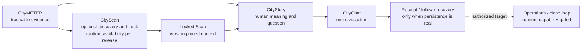

# CityChat Product Experience Profile v0.4 — CityStory-first, Intent-led, CityScan-aligned

**Document class:** CityChat product experience profile and interaction contract under Landometer Design System v0.9.0-r7
**Compatibility filename:** retained under `CityChat_design_system_*` so existing project references can migrate without losing discoverability
**Version:** v0.4
**Date:** 2026-08-21
**Evidence cutoff:** 2026-08-21
**Status:** Draft for product-owner, design, engineering, data/evidence, security/privacy and QA review
**Supersession:** Candidate replacement for CityChat Design System v0.3 only after explicit approval
**Primary language:** Thai; canonical product, component, state and rule names remain in English where required
**Audience:** Product, Design, Engineering, Content, Data/Evidence, QA, Operations, Delivery and AI coding agents
**Shared visual authority:** Landometer Design System v0.9.0-r7
**Product-truth input:** Product Brief CityChat v7 as current narrative baseline; Product Brief CityChat v8 as draft candidate for the updated product model

> **North-star interaction contract:** exact governed place or object → one evidence-backed meaning → what remains unknown → one safe useful action → persisted receipt, honest recovery, or clean completion.

> **CityChat design directive:** ทำให้คนรู้ว่ากำลังดูพื้นที่หรือเรื่องใด เข้าใจสิ่งสำคัญได้เร็ว เห็นว่าหลักฐานบอกอะไรและยังบอกอะไรไม่ได้ ทำสิ่งที่มีประโยชน์ได้หนึ่งอย่าง และรู้แน่ชัดว่าเกิดอะไรต่อ

---

## 0) Document Control, Scope and Authority

### 0.1 What this document is

เอกสารนี้เป็น **product-specific overlay** สำหรับ CityChat ไม่ใช่ visual design system อีกชุดหนึ่ง

ทีมทำงานต้องประกอบ source ตามลำดับนี้:

```text
approved product truth and release evidence
→ Landometer Design System v0.9.0-r7
→ this CityChat Product Experience Profile
→ applicable CityScan / data / security contracts
→ implementation manifest, control inventory and release receipt
```

เอกสารนี้กำกับเฉพาะ:

- user intent และ benefit ที่ CityChat ต้องส่งมอบ
- CityStory, StoryCell, CityScan entry, participation, receipt, follow และ close-loop behavior
- governed object, evidence, claim, state, permission และ channel-parity contracts
- CityChat-specific voice, content, component composition และ acceptance tests
- migration จาก CityChat Design System v0.3

เอกสารนี้ **ไม่กำกับและไม่ทำซ้ำ**:

- raw color values, gradients, typography files, spacing, radius, shadows, breakpoints หรือ z-index
- base button, field, focus, icon, theme หรือ motion implementation bytes
- shared accessibility, publication, performance หรือ general QA rules
- CityScan formula, weight, threshold หรือ metric activation ที่ยังไม่มี approved ADR
- product capability หรือ channel ที่ยังไม่มี release/runtime evidence

สิ่งเหล่านี้ต้องอ่านจาก source ที่เป็นเจ้าของเรื่องนั้นโดยตรง

### 0.2 Attached-document boundary

Landometer Design System ที่แนบมากับคำขอเป็น **reference authority** ไม่ใช่คำสั่งให้แก้ไฟล์ต้นทางหรือให้ทำตามข้อความทุกส่วนโดยไม่พิจารณา scope

การตรวจสำหรับ revision นี้พบว่า user-supplied attachment และ workspace reference เป็น byte-identical; reusable source path และ SHA-256 บันทึกใน Appendix A

ไฟล์ใน `sources/` คงเป็น read-only; v0.4 ถูกสร้างเป็นเอกสารใหม่

### 0.3 Authority by domain

Authority เป็นแบบแยกตามเรื่อง ไม่ใช่ลำดับเดียวครอบทุกอย่าง:

| Domain | Governing source | Rule in this profile |
|---|---|---|
| Product users, jobs, workflows, limits and intended outcomes | approved Product Brief / owner-approved ADR | v0.4 ขยาย interaction ได้ แต่ห้ามสร้าง product truth ใหม่ |
| Actual availability and runtime behavior | implementation evidence, release receipt and deployment authorization | present-tense capability claim ใช้ได้เฉพาะ release-proven scope |
| Shared brand, tokens, typography, icon, button, theme, motion, accessibility and QA | Landometer Design System v0.9.0-r7 | inherit by rule ID; ห้ามสร้าง local mini-system |
| CityChat interaction grammar and object/state behavior | this profile after approval | ต้องไม่ขัด product truth หรือ shared LDS |
| CityScan scoring, geometry, lock and claim detail | approved CityScan ADR/spec | exact CityScan contract ชนะ summary ในเอกสารนี้ภายใน scope ของมัน |
| Data meaning, readiness, source and claim ceiling | dataset/metric registry and evidence record | UI emphasis ห้ามยกระดับ claim |
| Privacy, security and legal authority | deployment-specific policy, DPO/security/legal review | checklist ไม่เท่ากับ compliance proof |

หาก source ขัดกัน:

1. หยุดการสรุปแบบเงียบ ๆ และบันทึก conflict
2. ใช้ source ที่มี authority ใน domain นั้นและมี version/date ชัดกว่า
3. downgrade capability เป็น unavailable/unknown จนกว่าจะ resolve
4. คง object, input และ recovery ให้ผู้ใช้
5. ห้ามใช้ visual polish ปิดบังความไม่แน่นอน

### 0.4 Normative language

ภายใน draft นี้:

| Level | Meaning after approval |
|---|---|
| **MUST / MUST NOT** | release requirement; failure blocks applicable release |
| **SHOULD / SHOULD NOT** | expected quality; exception needs owner, reason and expiry |
| **MAY** | optional; omission is not a defect |

ก่อน approval คำเหล่านี้เป็น proposed requirements ไม่ใช่หลักฐานว่า implementation มีอยู่แล้ว

### 0.5 Three independent truth dimensions

ทุก material capability ใน manifest, demo, sales excerpt และ release note MUST แยกสามมิตินี้:

| Dimension | Allowed values |
|---|---|
| `productAuthority` | `approved_truth`, `draft_truth`, `proposed`, `candidate`, `out_of_scope` |
| `capabilityEvidenceStatus` | `observed`, `release_proven`, `source_limited`, `not_evidenced`, `unresolved` |
| `deliveryAvailability` | `not_designed`, `designed`, `implemented`, `pilot`, `accepted`, `unresolved` |

กฎสำคัญ:

- approved truth ≠ implemented
- implemented ≠ authorized or public in every deployment
- observed ≠ release-proven
- designed ≠ available
- access tier ≠ data readiness ≠ permission
- commercial language, LOI หรือ visual emphasis ห้ามยกระดับสถานะใด

This product-capability field is separate from the exact LDS `publication.evidenceStatus` path (`verified`, `provisional`, `source_limited`). The local `publicationTruth.publicationEvidenceStatus` key mirrors that path without replacing it. They MUST NOT share a generic `evidenceStatus` key. Analytical proof absence instead uses the owning LDS `proof.sourceStatus: not_applicable` contract

### 0.6 Capability default

ใช้ default จาก LDS `[BUILD-01]` และ §1.1:

```text
capability = false or unknown
→ omit the control
→ no placeholder CTA
→ no simulated success
→ explain only when the limitation matters to the current user
```

Internal demo MAY simulate a local state only เมื่อ:

- มี label `Demonstration only` ที่เห็นชัด
- fixture ไม่ใช้ชื่อสถานที่/บุคคลจริงจนดูเหมือน production evidence
- action เปลี่ยนเพียง local state ที่ reset ได้
- ไม่มี external effect
- ไม่แสดง official, received, verified, closed หรือ persisted state ที่ไม่เกิดจริง

### 0.7 What v0.4 keeps and changes

| From v0.3 | v0.4 treatment |
|---|---|
| CityStory before dashboard | **Keep** as the human-meaning layer and direct-entry mode |
| One meaningful question and one-tap action | **Keep and tighten** to one main signal, up to three facts, one question and one primary action |
| Participation memory and receipt | **Keep as target contract**, but render only after real persistence |
| Civic close loop and relevant-circle sharing | **Keep**, capability- and authorization-gated; clean completion is valid |
| Warm, local, non-technical character | **Keep** and align to LDS CityChat profile |
| StoryCell = H3 | **Retire**; StoryCell is presentation, H3 res10 is optional CityScan evidence origin only |
| Local fonts, colors, CSS, radii and motion tokens | **Retire**; inherit current LDS exact package |
| Three generic stages/phases | **Replace** with separate ACC, CityScan readiness/data phase, LDF maturity, truth status and current permission |
| `LivePulse` and moving signal theatre | **Replace** with truthful settled AreaSignalStatus; live wording requires live telemetry proof |
| Saen Suk as product proof | **Retire unless evidence-qualified**; use governed fixture or acceptance record |

---

## 1) CityChat Experience Promise

### 1.1 One experience, different intents

CityChat MUST start from the user’s current intent, not from the ecosystem org chart.

| User | Intent in user language | First benefit | Useful next action | Honest completion |
|---|---|---|---|---|
| คนในพื้นที่ | “เรื่องนี้เกี่ยวกับพื้นที่ของฉันอย่างไร?” | เห็น one meaning พร้อมสถานะหลักฐาน | ยืนยัน ตอบ ติดตาม หรือรายงานหนึ่งอย่าง | receipt / follow state / clean exit |
| ผู้มาเยือนหรือผู้แชร์ลิงก์ | “ลิงก์นี้กำลังบอกอะไร?” | เข้าใจ object เดิมโดยไม่ต้องสมัคร | เปิดที่มา หรือทำ public-safe action | same-object deep link or clean exit |
| ผู้นำชุมชน/อาสาสมัคร | “ข้อมูลนี้ควรตรวจอะไรกับคนในพื้นที่?” | เห็นคำถามที่มีขอบเขตและ privacy ชัด | verify/enrich ภายใต้สิทธิ์ | persisted contribution + status |
| เจ้าหน้าที่ | “งานใดต้องตรวจ ส่งต่อ หรือสื่อสารกลับ?” | เห็น governed record, evidence gap and route | review, assign, request evidence or close one item | authoritative receipt/status |
| ผู้บริหารท้องถิ่น | “ข้อมูลและงานนี้ช่วยตัดสินใจอะไรได้?” | summary ที่รักษา source, limit and owner | inspect evidence or approve an authorized step | decision receipt or no-action completion |

Success is not time-on-site, click-through, streak, notification opt-in or share count. Success is:

- quicker correct understanding
- safer and lower-effort participation
- less duplicate officer work
- persisted, resumable and traceable state
- appropriate recipient action
- authoritative close-loop where capability exists

### 1.2 Core product character

CityChat MUST feel:

- calm, mobile-first, status-clear and consent-based
- local, warm, human and practical
- makes the city feel alive through real place, people, change and civic response—not synthetic pulse, fabricated count or decorative motion
- evidence-grounded without looking like expert GIS
- inviting without turning civic work into gamification
- clear about what is known, unknown, provisional and official
- respectful of both citizen effort and officer workload

CityChat MUST NOT feel like:

- a generic chatbot
- a complaint inbox with no return path
- a cold municipal dashboard as the citizen default
- a social feed that rewards noise or popularity
- an expert-only GIS console
- a system that watches people or pressures contribution
- a green “solved” screen without closure evidence
- a mock interface pretending an officer, municipality, sensor or workflow is live

### 1.3 Product-system role

The following is a **target ecosystem model**, not proof that every integration is live:



Direct-entry rule: ผู้ใช้ MAY เปิด governed CityStory โดยตรงจาก QR, shared link หรือ notification โดยไม่ผ่าน CityScan

CityScan rule: CityScan เป็น optional discovery route; CityStory ยังคงเป็น human meaning, question and action layer

### 1.4 Experience vocabulary

| Vocabulary | Use |
|---|---|
| `See → Understand → Participate → Act → Learn` | executive benefit narrative |
| `SCAN → LOCK → STORY` | optional discovery interaction |
| `SEE → ASK → FOLLOW/JOIN → VERIFY → ENRICH → ACT → CLOSE → ADVOCATE` | canonical civic participation and return loop |

ไม่มี loop ใดบังคับให้ผู้ใช้เดินครบทุกขั้น การอ่านแล้วจบอย่างเข้าใจ, การปฏิเสธ permission หรือ clean completion ล้วนเป็น valid outcomes

### 1.5 First-AHA contract

Operational profile MUST use `citychat.app` and inherit LDS `[AHA-01]`:

- no more than three short essential inputs before first value
- target first AHA within 10 seconds
- nonessential account, contact, notification, contribution, save, share or invite occurs after AHA
- if processing takes longer, show a meaningful partial state with assumptions and limits

Route-specific AHA:

| Route | First AHA |
|---|---|
| Direct CityStory | exact place/object + one meaning + truth/evidence cue + one next action or deliberate no-action |
| CityScan discovery | settled scan context + coverage/truth cue + safe next step such as Lock or refine |
| Report/verify | acknowledgement + current route/status + next step; receipt only after persistence |
| Officer work | current governed record + evidence gap/state + zero or one authorized next action, or clean completion |

Elapsed time alone is not an AHA. A user must be able to identify:

1. object/place
2. what matters
3. why it can be trusted at the stated level
4. what is still unknown or limited
5. what can happen next

### 1.6 One-state, one-job rule

Every page state MUST have:

- one user job
- one dominant governed object
- at most one primary action
- one visible recovery when the main task can fail
- either a next trigger or clean completion after the action

Secondary routes such as source detail, privacy, correction, share or cross-product exploration MUST NOT compete with an unresolved primary task

---

## 2) CityChat Build Card and Trigger Contract

### 2.1 Required Build Card

Every artifact or materially different route MUST complete the LDS Build Card and add this CityChat extension. The schema below is an authoring contract, not runtime evidence:

```yaml
citychatBuildCard:
  profileVersion: "0.4"
  artifactId: required
  routeId: required
  artifactKind: public_web | operational_web | line_adapter | export | demo_fixture
  activeLocale: th | en
  userRole: citizen | visitor | intermediary | officer | executive | internal_reviewer_for_demo_fixture_only
  userIntent: required_in_user_language
  userJob: required
  dominantObject:
    objectType: required
    objectId: required
    objectVersion: required
    placeOrBoundaryRef: required_when_spatial
  entryMode: direct_story | cityscan | report | follow | officer_work
  firstAha:
    promisedValue: required
    evidenceCue: required
    maximumEssentialInputs: required_from_selected_profile
    targetSeconds: required_from_selected_profile
  primaryAction:
    actionId: required_or_none_deliberate
    capabilityRef: required_when_action_exists
    nextTriggerOrCleanCompletion: required
  capabilities:
    eachMaterialCapability:
      productAuthority: required
      capabilityEvidenceStatus: required
      deliveryAvailability: required
      sourceRef: required
      deploymentAuthorization:
        state: authorized | not_authorized | unresolved
        deploymentRef: required
        policyVersion: required
        sourceRef: required
  evidence:
    truthEnvelopeRef: required_when_claim_or_effect
    sourceLedgerRef: required_when_claim
    evidenceLayerRoute: required_when_claim
  maturityRefs:
    accessTierRef: required_when_access_tier_applies
    spatialReadinessRef: required_when_cityscan_metric_applies
    dataPhaseRef: required_when_cityscan_data_phase_applies
    ldfMaturityRef: required_when_ldf_applies
  privacy:
    publicationVisibility: public | internal | private
    sensitivityClass: public | internal | confidential | restricted
    publicSafeProjectionRef: required_when_public_or_shared
    permissionMoment: required_when_permission_needed
  persistence:
    enabled: true | false
    authoritativeSystemRef: required_when_true
    idempotencyAndRecovery: required_when_true
  channels:
    rendered: []
    channelParityKey: required_when_more_than_one
  lds:
    releaseVersion: "0.9.0"
    authoringRevision: "0.9.0-r7"
    profile: citychat.app | data.explainer | campaign.public | social.static | presentation
    triggerPacks: []
    buildKitRef: required_for_web
  release:
    implementationRef: required_for_production
    controlInventoryRef: required_for_interactive
    qaEvidenceRef: required
    releaseReceiptRef: required_when_published_or_delivered
```

For `citychat.app`, resolve `maximumEssentialInputs: 0_to_3` and `targetSeconds: 10`. Every other profile copies its own current `[AHA-01]` values; this extension never overrides them. `internal_reviewer_for_demo_fixture_only` is valid only with `artifactKind: demo_fixture` and internal/private publication. ACC, R/P and LDF values remain versioned references to their owning registries, not local enums

### 2.2 Profile choice

| Artifact | LDS profile | Boundary |
|---|---|---|
| Operational participation, follow, officer workflow | `citychat.app` | specialized profile is mandatory; do not bypass with generic `product.app` |
| Read-only public CityStory explainer | `data.explainer` with `product: citychat` | keeps CityChat truth/privacy/voice; no operational controls unless capability is real |
| Public campaign landing | `campaign.public` | one promise, proof and CTA; no simulated report/follow |
| Static social artifact | `social.static` | destination must be verified and public-safe |
| Presentation | `presentation` | preserve sources and limits at actual viewing size |

### 2.3 Trigger packs

Load only when the actual route triggers them:

- every artifact loads the matching `[PUB-01]` branch
- every delivery loads the matching `[DELIVERY-01]` branch

| Capability | Required LDS pack(s) |
|---|---|
| analytical signal, score, estimate, comparison | `[DATA-01]` |
| chart or governed quantitative scale | `[DATAVIZ-01]` |
| interactive or explanatory map | `[MAP-01]` and `[DATA-01]`; choropleth, governed classification or spatial density also `[DATAVIZ-01]` |
| share or copy exact object | `[SHARE-01]`; `direct_send`, `post` or `invite` also require `[EFFECT-01]` and `[ABUSE-INTEGRITY-01]` |
| citizen contribution or co-creation | `[COCREATE-01]`, `[EFFECT-01]`, applicable `[AUTH-01]` and `[ABUSE-INTEGRITY-01]` |
| saved Lock, receipt, assignment, publish or status update | `[EFFECT-01]`; `[AUTH-01]` when identity/permission applies |
| every artifact | matching `[PUB-01]` branch; add `[WEB-DISCOVERY-01]` only for applicable public deployable discovery |
| persistent personal follow or learning | `[LEARN-01]` with explicit consent and deletion |
| instrumentation | `[TELEMETRY-01]` |
| follow, watch or saved return state | `[HOOK-01]`, `[EFFECT-01]`, applicable `[AUTH-01]` and `[ABUSE-INTEGRITY-01]`; persistence, delete/unfollow, permission re-check and failure recovery are mandatory |
| post-persistence return invitation | `[HOOK-01]`; render only after the useful effect is real, with an honest `disabledReason` when unavailable |
| invited contribution or co-creation | `[HOOK-01]`, `[COCREATE-01]`, `[EFFECT-01]`, applicable `[AUTH-01]` and `[ABUSE-INTEGRITY-01]`; invitation acceptance never implies contribution or outcome |
| adjacent Landometer destination | `[XPRODUCT-01]` |
| every delivery | matching `[DELIVERY-01]` branch, including deployable, portable, static and internal demo |

Unknown or false pack trigger MUST NOT create a control merely because the pattern exists in this profile

---

## 3) Governed Object, Evidence and Truth Model

### 3.1 Base governed context

Every StoryCell, Scan, action, receipt, share and officer object MUST resolve to a stable context:

```yaml
contextRef:
  objectType: required
  objectId: required
  objectVersion: required
  placeId: required_when_place_based
  boundaryId: required_when_boundary_based
  boundaryVersion: required_when_boundary_based
  geometryRef: required_when_geometry_matters
  sourceSnapshotRef: required_when_evidence_based
  publicSafeProjectionRef: required_when_public_or_shared
```

Deep links MUST restore the exact governed object and meaningful state, not merely scroll near a generic page

### 3.2 Canonical evidence flow

```text
normalized observation — source of truth
→ derived calculation
→ versioned Evidence Capsule/read model
→ Locked Scan or direct governed Story context
→ CityStory / StoryCell claim
→ CityChat action
→ receipt / task / outcome record
```

An Evidence Capsule is not the source of truth and is not an action destination. Stable IDs and versions connect the chain

### 3.3 Typed truth envelope and anti-collision rule

Every material object MUST keep capability, analytical, authorization, publication and workflow truth in typed subrecords. `required_when_*` means the subrecord is omitted—not filled with invented values—when the condition is false:

```yaml
truthEnvelope:
  capabilityTruth:
    productAuthority: approved_truth | draft_truth | proposed | candidate | out_of_scope
    capabilityEvidenceStatus: observed | release_proven | source_limited | not_evidenced | unresolved
    deliveryAvailability: not_designed | designed | implemented | pilot | accepted | unresolved
    sourceRef: required
  analyticalTruth: # required_when_analytical
    claimLevel: no_claim | observe | compare | flag | suggest_question | validate | prioritize | verified_status
    claimLabel: required_when_claimLevel_is_not_no_claim # verified|current|estimate|forecast|user_report|ai_synthesis|planned
    signalClass: required_when_claimLevel_is_not_no_claim # observed|official|calculated|proxy|modelled|recommendation
    valueState: required_when_quantitative_or_no_claim_is_data_driven # canonical §3.6 enum
    evidenceRef: required_when_claimLevel_is_not_no_claim
    noClaimReasonRef: required_when_claimLevel_is_no_claim
  authorizationTruth: # required_when_permission_or_effect
    currentActorDecision: allowed | denied | expired | checking | not_applicable
    tenantRef: required_when_tenant_scoped
    requestedScope: required
    evaluatedAt: required
    policyRef: required
  publicationTruth: # required_for_every_artifact
    publicationVisibility: public | internal | private
    sensitivityClass: public | internal | confidential | restricted
    publicationEvidenceStatus: verified | provisional | source_limited
    publicSafeProjectionRef: required_when_public_or_shared
  workflowTruth: # required_when_a_workflow_exists
    workflowStatusRef: required
    authoritativeOwnerRef: required
```

MUST NOT create a bare universal field named `status`, `stage`, `phase` or `claim` to collapse these meanings. `workflowStatus` belongs to the owning workflow registry; this profile does not invent one official-status enum for every LGU or module

### 3.4 StoryCell is not H3

`StoryCell` is a presentation component. It MAY be backed by:

- a direct governed place/story object
- a Locked Scan
- an object-native work order, KPI, service, boundary or authorized outcome record

It MUST NOT require `h3_ids`

H3 res10 is used only when the owning spatial contract requires it, especially CityScan baseline-v1 evidence. LGU-level values, household records, work orders, KPI records and official status MUST retain native grain; an H3 projection is optional and MUST NOT create false precision

### 3.5 Claim ladder

The following product claim ladder is a `candidate` from the draft v8 product model. It MUST NOT be treated as approved runtime or public-copy authority until Product Brief v8 or an owning ADR is explicitly approved. Until then, the approved product baseline and each capability's effective claim ceiling remain authoritative:

| Level | Claim | Minimum meaning |
|---:|---|---|
| 0 | `no_claim` | honest unavailable, no-data or suppressed state |
| 1 | `observe` | raw/derived observation with unit, scope, date and source |
| 2 | `compare` | relative position under a named baseline |
| 3 | `flag` | unusual/contrasting signal without diagnosis |
| 4 | `suggest_question` | one bounded question to verify |
| 5 | `validate` | bounded local/participatory confirmation with method/sample/privacy |
| 6 | `prioritize` | operational attention under approved rule, owner and alternatives |
| 7 | `verified_status` | authoritative workflow status/outcome with timestamp and audit |

Effective claim ceiling is the lowest allowed by product/data phase, dataset/metric, value state, freshness, coverage, uncertainty, privacy/license/display rights, role/authorization and content template

High score, user role, commercial tier, copy style, color or component emphasis MUST NOT raise the ceiling

### 3.6 Value and workflow states stay separate

Canonical analytical `valueState`:

- `observed`
- `observed_zero`
- `censored_above`
- `censored_below`
- `unknown`
- `out_of_coverage`
- `not_applicable`
- `suppressed_privacy`
- `stale`

Do not merge these with:

- processing state such as `loading`, `partial`, `error`, `offline`
- readiness such as `provisional`, `shadow`, `R2`, `R3`
- workflow status such as `received`, `reviewing`, `assigned`, `closed`
- authority such as `official` or `officer_verified`
- current permission such as `allowed`, `denied`, `expired`

`unknown`, `out_of_coverage`, `not_applicable`, `suppressed_privacy` and `stale` MUST NOT become zero. `censored_*` MUST NOT render as an exact value

### 3.7 Shared truthful UI states

Use LDS `[STATE-01]` where applicable:

`default`, `hover`, `focus-visible`, `active`, `selected`, `disabled`, `loading`, `partial`, `stale`, `reconciling`, `success`, `warning`, `error`, `empty`, `offline`, `restricted`, `permission-denied`, `retrying`, `cancelled`, `conflict`

Additional CityChat domain states MUST map to a clear shared UI state and preserve their domain meaning. In particular:

- selected ≠ locked
- locked ≠ published
- submitted ≠ received by officer
- received ≠ reviewed
- reviewed ≠ verified
- sent ≠ delivered
- delivered ≠ understood
- closed ≠ improved outcome

---

## 4) Experience Modes and State Machines

### 4.1 Direct CityStory mode

Use for QR, shared link, public route or notification when the object is already known:

```text
exact place/story
→ one evidence-backed meaning
→ compact truth/status cue
→ one bounded question
→ one primary action or deliberate clean completion
→ receipt / next trigger / recovery
```

Direct mode MUST:

- work without a Locked Scan
- restore object and version from the link
- show place/boundary identity before interpretation
- expose L2 evidence one explicit interaction away
- omit action when capability or permission is unresolved
- never redirect a public reader into login before the promised read-only AHA unless identity is intrinsic to the task

### 4.2 CityScan discovery mode

```text
SCAN
→ settled SIGNAL READY or honest no-score
→ LOCK
→ STORY
→ zero or one authorized CityChat action, or clean completion
```

This profile defines the experience boundary. Exact scoring and metric rules remain owned by approved CityScan documents

| Domain state | User meaning | Allowed action | Prohibited implication |
|---|---|---|---|
| `idle / scanning` | frame or request is changing | pan, zoom, change area | final score, live sensor or stable selection |
| `settling / signal_ready` | latest valid response for current frame | inspect evidence, refine, Lock | share as governed result before Lock |
| `insufficient / out_of_range` | score not eligible for stated reason | inspect reason, change frame | zero or positive result |
| `error / offline / restricted` | request, network or permission failed | retry, recover or exit | empty data, success or official status |
| `locking` | persistence is pending | wait or cancel where safe | saved/locked receipt |
| `locked` | exact object/version persisted | open Story, exact-link share if authorized | silent recalibration on reopen |
| `story_loading / story_error` | Story is being derived or failed for this Lock | retry Story or return to the same Locked Scan | new scan, changed score or lost Lock context |
| `story_ready` | narrative is bound to governed context | inspect, answer or follow | generic story disconnected from evidence |
| `snapshot_unavailable` | historical snapshot cannot be restored under the recorded retention boundary | inspect the limitation or start a clearly new current scan | substitute a current recalculation for the historical result |

#### Scan Frame integrity

The visible Scan Frame MUST equal the calculation geometry. Map selection, legend, readout, evidence, action and text alternative MUST represent one synchronized state

Latest-request-wins behavior is mandatory: an older response MUST NOT overwrite a newer frame, and an old score MUST NOT remain visible over a new no-score or error state

All topic signals in one `signal_ready` state MUST share one response version and update atomically. A mixed old/new topic set remains `settling` or becomes an honest error; it is never Lock-eligible

#### LOCK integrity

A persisted Locked Scan MUST preserve at least:

- geometry and geometry hash
- canonical Scan Window polygon, ordered H3 res10 cell IDs and overlap weights for CityScan baseline v1
- effective/valid-surface version
- source dataset versions and immutable data snapshot ID
- baseline ID and eligibility population/universe
- metric/transform/membership/weight versions
- aggregation mode, exact score response, topic values/distributions, value states, coverage, freshness and no-score reasons
- selected topic context
- immutable response snapshot or immutable reproducible reference
- claim-validator and content-template versions
- lock time, actor, requested scope, policy version and share intent

Reopen MUST reproduce the historical result from its snapshot/version. Reopen/share MUST re-evaluate current authorization, tenant and share policy; a frozen audit scope is never a reusable permission grant

Failed Lock emits no Locked Scan ID and no receipt

LOCK uses a server-issued opaque `signalReadyToken` bound to the latest frame, response version, snapshot, tenant and current actor scope. The server MUST reject an expired, stale, replayed, mismatched or unauthorized token; authoritative cells, weights, tenant and role scope are server-derived, never trusted from the client

On success the server issues an opaque `lockedScanId`. Authorization is checked on every read, reopen and share; cross-tenant/cross-role ID access returns a non-leaking restricted/not-found response and is covered by an IDOR test

`UNLOCK` starts a new transient scan context; it never mutates or silently recalculates the existing Locked Scan. Story retry returns to the same Lock. `snapshot_unavailable` is allowed only for an historical reopen after the governed retention/loss condition and cannot stand in for a current result

### 4.3 Participation mode

```text
meaning and question
→ minimum necessary input
→ review scope, visibility and consequence
→ submit
→ pending
→ persisted receipt or error/recovery
→ next trigger or clean completion
```

Contribution UI MUST NOT render until submission, moderation, correction/withdrawal/dispute, receipt, visibility, retention and failure recovery exist for the deployment

Participation that does not persist MUST NOT enter the civic loop or produce a success receipt

### 4.4 Officer and close-loop mode

Officer surfaces use object-native records and MUST show:

- stable record/schema version
- authoritative owner or source/import reference
- current status and allowed transitions
- role/tenant/permission
- evidence attachments or hashes where required
- deadline/SLA when applicable
- audit and correction history
- public-safe projection
- zero or one authorized next action, or explicit clean completion
- closure authority and close-loop message

CityChat is designed as an orchestration/evidence layer above existing government systems. It MUST NOT present itself as e-LAAS, LTAX, e-GP or another official system of record without an explicit approved system contract

### 4.5 Return, follow and advocate

Return triggers MAY appear only when they benefit the user:

- a followed area has a new question or evidence request
- an official update or data-maturity state changes
- an officer work item, deadline, evidence gap or field result changes
- a correction/dispute needs attention

Advocate/share appears after value or when another relevant perspective is genuinely needed. It MUST NOT be treated as a mandatory loop step

Citizen share targets relevant circles. Officer share targets an approved briefing or playbook only after measured value and public-safe context exist

One artifact promotes at most one return loop. No engineered variable reward, streak, countdown, loss framing or unexplained ranking change. A utility route MAY declare no loop and end cleanly

### 4.6 Cross-product continuation

CityChat MAY show one to three adjacent Landometer paths only after the current AHA or in Closure. Each path MUST be driven by the user’s next intent, not the ecosystem org chart

Examples, only when the destination is honestly available:

- “ดูหลักฐานพื้นที่ชุดนี้ใน CityMETER”
- “ทำความเข้าใจบริบทของสถานที่นี้ใน CityWiki”
- “กลับมาติดตามคำตอบหรือสถานะของเรื่องนี้ใน CityChat”

Each path carries exact object/locale IDs, evidence labels, limitation and destination availability. If full context cannot transfer, the link says what will and will not carry over. Measure recipient useful action, not click-through alone

---

## 5) Shared Visual and Interaction Inheritance

### 5.1 No parallel visual system

All rendered CityChat surfaces MUST inherit the exact current LDS package for:

- tokens and semantic color roles
- font assets, script subsets and type roles
- spacing, container, radius, depth, breakpoint and z-index
- button geometry and focus treatment
- icon system
- theme initialization
- Riddim motion
- base components and accessibility behavior

Do not copy old v0.3 CSS or create a CityChat token file with changed values. Product aliases MAY exist only as semantic `var()` bindings to current canonical tokens and must be recorded in the build manifest

#### P0 delivery-identity dependency

The supplied LDS r7 Markdown contains stale delivery-identity literals even though its authoring header and amendment ledger identify the intended current release:

- current intended identity: `color-srgb-05`, `lds-kit-0.9.0-r4`, machine package `v0.9.0-mp1`
- Appendix E3 skeleton still contains `color-srgb-03`
- the LDS Definition of Done still contains `color-srgb-02`

Therefore dev MUST NOT copy or hard-code Color Set, kit, artifact-build or receipt IDs from those prose/skeleton literals. Before production:

1. obtain the validated current `v0.9.0-mp1` machine package or owner-approved successor
2. verify package SHA-256 manifest and kit bytes
3. derive `deliveryIdentity.colorSetId`, kit version, token-registry hash and release receipt from that package
4. record the reconciliation in the CityChat Build Card

The synced project source did not include the machine package at document-authoring time. The CityChat publication workflow resolved the official public upstream at Landometer repository commit `d82ac775ab9d35a84cfb0dc77bc0ae804a7a0665`; its `v0.9.0-mp1` report records 143 package checks and 0 failures. A downstream artifact MUST still pin or vendor the exact package bytes and hashes and run its own applicable checks. Package consistency does not certify CityChat artifact conformance, so keep `machineValidation: pending` until artifact-specific automated and manual evidence passes

### 5.2 CityChat visual character

Product-specific visual emphasis:

- warm, modern, local and human
- place, people, community and useful action remain visible
- public view reads as a story grounded by a map, not a map surrounded by dashboard chrome
- officer view is denser but still one governed record and one next action at a time
- evidence feels inspectable, not heavy or punitive
- status is explicit and calm; urgency appears only from authoritative state

Select one to three LDS brand-memory signatures per scene:

| Signature | CityChat use |
|---|---|
| **Measure** | claim/status chip, source/date, coverage or receipt |
| **Ground** | exact place, boundary, geometry and local context |
| **Cultivate** | one civic action, contribution memory and close-loop benefit |

Do not render signatures as decoration or as three mandatory widgets

Use LDS `[MEDIA-LADDER-01]` to choose the richest truthful medium within the delivery budget:

```text
real product/place/work video
→ photograph, diagram, map or chart
→ Material Symbols Rounded icon + label
→ prose for exact claim and evidence wording
```

Video/photo MUST be documentary and permissioned; no generic b-roll or AI-generated documentary evidence. CityChat product tasks never add media merely to look lively. Long explanation moves to a labelled disclosure while the first view preserves the object, meaning and action

### 5.3 Typography

Use LDS `[TYPE-01]` exactly. For r7, the role mapping relevant to CityChat is:

| Role | Current family/weight authority |
|---|---|
| Thai Product UI heading/card title | IBM Plex Sans Thai Looped 700 |
| English Product UI heading/card title | Arvo 700 |
| Thai and English body/UI/nav/button/form/label | Bai Jamjuree 400/600 |
| Latin IDs, numerals and short technical labels | JetBrains Mono 400 |
| Thai technical-glyph companion where required | IBM Plex Sans Thai 400 |

Do not set type by visual resemblance. Self-host the exact required subsets in production. User-read text floors and responsive leading remain governed by LDS

### 5.4 Color and theme

- use only current semantic LDS color tokens and exact governed recipes
- use the current CityChat product-identity atmosphere recipe only for identity, entry or direction
- identity gradient MUST NOT encode score, risk, coverage, workflow state or official outcome
- data, status and map layers use their canonical semantic registries
- no raw hex outside the canonical token/build-kit block
- no local violet, fuchsia, muddy-brown or legacy v0.3 palette
- new or materially changed interactive web surfaces default to Auto theme unless a documented LDS exception applies
- every status remains understandable without color

Green never means “solved” unless text, authority, timestamp and closure evidence all support that state

### 5.5 Layout, surfaces and cards

- use open sections, grids, direct labels and real place/work evidence before card stacks
- a card exists only when an object needs a boundary or interaction state
- one page state has no more than two bounded panels, and only for a real comparison
- StoryCell, map panel, tab, selector, field and status chip MUST NOT be styled as buttons
- enumerations over six rows or taller than their sibling container use answer-first summary + bounded accessible disclosure under `[CONTAINER-FIT-01]`
- perceptual quiet is a calm attention condition, not an empty tinted filler card
- connectors render only when they encode a real relationship and have an accessible alternative

Per active scene, use these maxima—not a checklist:

- zero or one concise heading
- zero or one support sentence
- zero or one question/proof
- zero to five labels/steps only when sequence needs them
- zero or one primary action
- no more than two bounded panels, only for a real comparison

### 5.6 Buttons and icons

Inherit LDS `[BTN-GEOM-01]` and `[ICON-01]`:

- text or icon+label action = capsule
- icon-only action = equal-width/height circle
- minimum interactive target = 44 × 44 CSS px
- no third button geometry
- UI icons = Material Symbols Rounded with the current locked axes and self-hosted production subset
- icon never replaces accessible name, label, evidence or instruction
- selected icon fill MAY change only under the shared icon rule

One primary action per active state. Evidence, privacy and correction are quiet secondary routes unless they are the current job

### 5.7 Motion and feedback

CityChat uses LDS Riddim only. The operational `citychat.app` profile uses the `state_led` posture; derivative artifacts MUST use the motion intensity declared by their selected LDS profile, such as `guided`, `expressive_short` or `export_safe`:

| Event | Intended feedback |
|---|---|
| page/group enters | `citychat.app` uses no generic reveal; a compatible `guided`/`expressive_short` derivative MAY use the exact one-time LDS reveal when it carries reading order |
| tap/press | Downbeat press; immediate acknowledgement without fake completion |
| settled scan result | one stable state transition; screen reader announces settled result only |
| successful persisted action | immediate state-led transition using the current LDS state easing; no One-drop overshoot under `citychat.app` |
| count changes | static authoritative replacement under `citychat.app`; count-up MAY appear only in a compatible profile and never for transient CityScan or synthetic participation |
| error/offline/conflict | direct state replacement with recovery; no shake or panic loop |

MUST NOT use bounce, repeated pulse, shimmer, orbit, parallax, autoplay sound or artificial urgency

Reduced-motion MUST reveal the final meaningful content without animation. A no-JavaScript public/read-only route preserves its content baseline; an intrinsically JavaScript-dependent CityScan or operational route renders an honest non-operable fallback and safe route, never a fabricated final result. Motion never changes score, truth, status or evidence

---

## 6) CityChat Voice, Copy and Disclosure

### 6.1 CityChat voice record `[CITYCHAT-VOICE-01]`

CityChat copy starts with the place or work object, explains what matters in natural language, names the truth state without drama, and offers only an action that is available and safe

Default movement:

```text
พื้นที่หรือเรื่องที่กำลังดู
→ สิ่งสำคัญที่หลักฐานแสดง
→ สิ่งที่ยังต้องตรวจหรือยังบอกไม่ได้
→ คำถามเดียวที่มีประโยชน์
→ การทำต่อหนึ่งอย่าง
→ receipt, next trigger, recovery or clean completion
```

Voice qualities:

- clear, grounded and encouraging
- calm during uncertainty or failure
- respectful of citizen time and officer responsibility
- specific about source, state and consequence
- never bureaucratic, scolding, promotional or AI-generic

### 6.2 Native Thai first

- author Thai from intent, evidence and local usage; do not translate rendered English strings
- complete Thai review before bilingual parity review
- preserve Thai marks, line rhythm and readable size
- do not shorten by deleting object, consequence, evidence boundary or action
- use one active language at a time
- if English ships, both locales resolve to the same fact/evidence record; sentence structure need not match

### 6.3 Human-facing disclosure

Inherit LDS `[DISCLOSURE-01]`:

| Layer | Content |
|---|---|
| **L1 answer view** | object → truthful meaning/status → one action; compact typed claim/source chips |
| **L2 evidence layer — ที่มาและข้อจำกัด** | source, date, method, coverage, confidence, missingness, limitation and allowed uses |
| **L3 deep reference** | full method, version history, ledger and QA evidence |

L1 contains no generic caution banner or disclaimer prose. Truth stays in:

1. the claim wording itself, such as `ค่าประมาณ`, `proxy`, `ข้อมูลถึงวันที่...`
2. compact typed claim/source-status chips
3. one quiet `ที่มา` affordance into L2

Material reversal, legal, safety and privacy notices appear at the decision moment and MUST NOT be buried

### 6.4 Public copy formula

```text
[พื้นที่/เรื่อง]
[หนึ่งความหมายที่ evidence รองรับ]
[status/source chip]  [ที่มา]
[หนึ่งคำถาม]
[หนึ่ง primary action]
```

Example — bounded proxy wording:

> พื้นที่นี้มีระดับสัญญาณด้านการเข้าถึงบริการต่ำกว่ากลุ่มเปรียบเทียบภายใต้ baseline รุ่นนี้
> แบบจำลอง · ข้อมูลถึง [date] · [ที่มา]
> ข้อมูลในพื้นที่จริงสอดคล้องกับสัญญาณนี้หรือไม่?
> **ช่วยยืนยันข้อมูล**

Example — no-score:

> พื้นที่นี้ยังเปรียบเทียบไม่ได้ เพราะหลักฐานครอบคลุมไม่ถึงเกณฑ์ที่กำหนด
> **ปรับพื้นที่ที่กำลังดู**

Never replace no-score with `0`, `ปกติ`, `ดี` or a blank chart

### 6.5 Receipt copy

Receipt copy describes only the authoritative result:

- `บันทึกคำตอบแล้ว` only after the response persisted
- `ส่งเข้าคิวตรวจแล้ว` only after the authoritative queue accepted it
- `ได้รับเรื่องแล้ว` only when the receiving system confirms receipt
- `ปิดงานแล้ว` only with authorized closure owner, timestamp and evidence

If persistence fails:

> ยังบันทึกไม่ได้ คำตอบของคุณยังอยู่บนอุปกรณ์นี้
> **ลองอีกครั้ง**

Do not show success color, confetti or receipt ID before persistence completes

### 6.6 Internal vs user-facing language

Internal-only terms such as `H3 res10`, `R3`, `SPS`, `TPS`, `claim ceiling`, `channelParityKey`, `idempotency` and `ADR` MUST be translated into user meaning or remain in L2/L3 technical detail

| Internal term | User-facing expression example |
|---|---|
| `coverage below gate` | `หลักฐานยังครอบคลุมไม่พอสำหรับการเปรียบเทียบ` |
| `modelled` | `ค่าประมาณจากแบบจำลอง` |
| `stale` | `ข้อมูลชุดนี้ยังไม่ได้อัปเดตตามรอบล่าสุด` |
| `permission_denied` | `บัญชีนี้ยังไม่มีสิทธิ์ทำรายการนี้` |
| `conflict` | `รายการนี้มีการเปลี่ยนแปลงจากอีกหน้าจอ กรุณาตรวจเวอร์ชันล่าสุด` |

### 6.7 Forbidden copy

MUST NOT say or imply without exact evidence:

- `real-time`, `live`, `ทุกคน`, `ทุกพื้นที่`, `พร้อมใช้ทันที`
- `เทศบาลรับเรื่องแล้ว`, `เจ้าหน้าที่กำลังดำเนินการ`, `ปิดแล้ว`
- `ปลอดภัย`, `น่าอยู่`, `ควรลงทุน`, `บริการเพียงพอ`
- `คนส่วนใหญ่คิดว่า...` from self-selected participation
- `คะแนนสูงจึงควร prioritise` without an approved decision rule
- `ข้อมูลครบ`, `verified`, `official` without scope, authority and date
- habit, community impact or network-effect claims from clicks or sends

---

## 7) CityChat Component Contracts

### 7.1 Component rule

Every component MUST define:

- one job and one governed object
- required data and authority
- reachable states
- zero or one primary action
- feedback and recovery
- accessibility name, keyboard/touch behavior and status announcement
- capability truth triplet and deployment authorization
- source rule IDs and an invoking acceptance test

Presence in this catalog does not mean implementation or availability

### 7.2 `GovernedContextHeader`

**Job:** answer “กำลังดูพื้นที่หรือ object ใด” before interpretation

Required:

- `contextRef`
- human place/object label
- relevant boundary/time label
- authority/status when material
- deep link restoring same context
- public-safe projection reference when public/shared

Direct Story MUST NOT require H3. Scan-origin Story MUST reference a Locked Scan

### 7.3 `StoryCell`

**Job:** turn one governed context into human meaning, one question and one useful action

```yaml
storyCell:
  storyCellId: required
  contextRef: required
  signal:
    text: required
    analyticalTruthRef: required
    evidenceRef: required
  facts:                       # 0..3
    - factId: required
      text: required
      evidenceRef: required
      analyticalTruthRef: required
  question: required           # exactly one
  evidenceSummary:
    claimLabel: required_from_analyticalTruthRef
    signalClass: required_from_analyticalTruthRef
    periodOrValidTime: required_when_temporal
    coverage: required_when_relevant
    freshness: required_when_update_cadence_exists
    limitationRef: required
  primaryAction: required_or_none_deliberate
  postAction:
    receiptRef: required_when_persisted_effect
    nextTriggerOrCleanCompletion: required
    recoveryRef: required_when_effect_can_fail
  channelParityKey: required_when_cross_channel
```

Acceptance:

- one main signal
- zero to three supporting facts
- exactly one bounded question
- at most one primary action
- place/object and truth state understandable in 15 seconds
- every fact resolves to source/evidence
- direct variant passes without H3
- L2 evidence is one interaction away
- share/export preserves object/version, claim, limitation, visibility and action availability

### 7.4 `EvidenceSummary` and `EvidenceDrawer`

`EvidenceSummary` is the compact L1 trust affordance. `EvidenceDrawer` is L2 and MUST expose, when applicable:

- source owner, dataset/entity and version
- observation period and last updated
- geography grain and coverage
- exact LDS `signalClass`: observed, official, calculated, proxy, modelled or recommendation
- transform/source class as a separate evidence field when the analytical record requires it
- method, baseline and comparison universe
- quality/confidence and limitation
- missing/no-score reason
- claim level and effective ceiling
- allowed uses
- privacy, license and display rights

Drawer MUST be keyboard-operable, labelled, deep-link-restorable and not a hover-only tooltip

### 7.5 `PrimaryAction`

```yaml
primaryAction:
  actionId: required
  intent: required
  targetContextRef: required
  capabilityRef: required
  eligibility: required
  authorizationDecisionRef: required
  navigationOrEffect: navigation | local_state | persisted_effect
  destinationOrEffectTarget: required
  immediateConsequence: required
  expectedAuthoritativeFinalState: required_when_persisted_effect
  confirmationPolicy: none | review_scope | consequential_confirm
  pendingState: required_when_effect
  successReceiptType: required_when_effect
  failureRecovery: required
  idempotencyKey: required_when_duplicate_effect_is_harmful
```

If capability is false/unknown, omit the control. A disabled primary control is allowed only when the user can understand and remedy a missing requirement without guessing

### 7.6 `ActionReceipt`

**Job:** prove what actually happened and make state resumable

Required after real persistence:

- receipt ID
- action ID
- exact context/object/version
- persisted timestamp
- authoritative state and source
- actor/scope where appropriate
- visibility
- next trigger or clean completion
- recovery/correction route

Receipt MUST NOT be optimistic UI. A toast may acknowledge a tap but is not the durable receipt

### 7.7 `AreaSignalStatus`, `CityScanFrame`, `ScanReadout` and `LockControl`

**AreaSignalStatus** replaces v0.3 `LivePulse`. It is a settled, evidence-bound status composition for a non-scan place/object and contains:

- exact context reference
- one analytical truth-envelope reference
- last-updated/freshness and coverage when relevant
- shared processing/value states
- one EvidenceSummary route

It MUST NOT use `live`, pulse, moving counter or automatic sweep unless live telemetry and the named update contract are release-proven. A non-scan surface that needs only a static explanation SHOULD use `EvidenceSummary` rather than render this component

**CityScanFrame** shows visible/calculated geometry, focus reticle and current frame identity

**ScanReadout** shows separate topic signals, coverage, freshness, baseline, value state and no-score reason. It MUST NOT combine topics into an unsupported overall verdict

**LockControl** appears only for a settled eligible context and transitions through pending to persisted Locked Scan or failure/recovery

Requirements:

- geometry/readout/legend/evidence/action/text alternative synchronized
- transient values visually and semantically distinct from settled values
- all topic signals update atomically under one response version
- screen reader announces settled/locked result, not every moving digit
- no share before Lock for scan-origin governed result
- Lock uses the latest server-issued `signalReadyToken`; stale/mismatched/unauthorized tokens fail closed
- failed Lock has no ID and no success state
- successful Lock uses a server-issued opaque ID and server-derived canonical scope
- historical reopen does not silently recalculate
- Story error returns to the same Lock; Unlock creates a new scan and never mutates history
- authorization and share policy re-evaluated on reopen/share

### 7.8 `ContributionPrompt`

Required fields:

- purpose and user benefit
- minimum fields
- sensitivity classification
- visibility and recipient
- consent/legal basis where applicable
- retention/deletion
- moderation state
- correction/withdraw/dispute route
- failure recovery

Default impact claim is none until verified. Submission or acceptance is not community impact

### 7.9 `FollowArea` / `WatchArea`

Follow is a voluntary post-AHA investment. Before enabling, explain:

- exact area/object being followed
- which updates may trigger a return
- notification channel and frequency
- whether identity/contact is required
- how to pause, change or delete

If notification persistence is not release-proven, do not promise a notification. Offer an exact resumable link instead

### 7.10 `RelevantCircleShare`

Flow:

```text
AHA
→ understand exact safe object
→ one contextual share action
→ preview visibility and recipient value
→ handoff receipt
→ recipient lands on same object/version
→ recipient AHA or useful action
```

Default safe mechanisms are `exact_link` and `copy_draft`. Direct send/post/invite requires applicable effect and abuse/integrity contracts

Copy/send success is a **handoff receipt only**. It is not delivery, recipient understanding/AHA, useful action or network effect. Measure recipient outcome separately

### 7.11 `OfficerModerationItem`

Required:

- native record ID/version
- citizen-safe summary and restricted detail separation
- source/evidence status
- duplicate/similar-record cue where approved
- owner/role and current state
- allowed transition
- zero or one recommended authorized next action, or explicit clean completion
- audit entry and recovery

Participation popularity alone MUST NOT set priority. Prioritization needs approved rule, responsible owner, alternatives and claim level `prioritize`

### 7.12 `OperationsObject` and `CloseLoopMessage`

Operations remains capability-gated. `CloseLoopMessage` MUST include:

- what changed
- responsible authority/owner
- status and timestamp
- evidence or authoritative record reference
- what the user should expect next
- correction/contact route where appropriate

No closure message from visual state, score, elapsed time or internal optimistic status alone

### 7.13 System states

Use the inherited LDS `EmptyState` and `ErrorState` components. Compose offline, permission-denied, conflict, retrying and restricted views from shared primitives plus the exact `[STATE-01]` vocabulary; this profile does not claim those names as inherited shared components

Every failure state MUST preserve the user’s governed object and safe input when possible, explain what happened in plain language, offer one recovery or clean exit, and avoid blame

---

## 8) Map, Data Visualization and Signal Rules

### 8.1 Map role

The story is the human meaning; the map grounds it in place

Every CityChat map MUST:

- read as a real place with governed geometry and orientation context
- synchronize selection, geometry, legend, readout, evidence, next action and accessible alternative
- provide keyboard/touch operation without precision pointing
- provide text/list equivalent for essential meaning
- distinguish hover, focus, selection, category, magnitude, semantic status and no-data
- preserve source, period, units, boundary and scale version

Map identity/atmosphere color MUST NOT encode data or status

### 8.2 Charts and scales

- use the LDS canonical data-visualization registries
- show baseline, unit, period, coverage, freshness and no-score reason
- coverage and confidence remain separate from score
- no pie, donut or gauge composition where prohibited by `[DATAVIZ-01]`
- no red/green-only meaning
- no animated random number, fake sweep or synthetic liveness
- no overall safety/liveability/investment grade unless separately approved with evidence and governance

### 8.3 Proxy visibility

Proxy/modelled wording appears in the first visible interpretation, not only deep provenance

Examples:

- distance to hospital = access proxy, not response time or service sufficiency
- POI density = place-presence/activity proxy, not footfall or popularity
- modelled population = estimated resident-base signal, not census or customers
- listing/appraisal value = cost/value pressure context, not spending power or ROI

---

## 9) Channel, Permission, Privacy and Security

### 9.1 Target channel architecture

Channel presence is a target model; actual availability is per deployment:

| Channel | Intended role | Release boundary |
|---|---|---|
| Public web / QR / shared link | immediate CityStory AHA and public-safe action | destination, metadata, object restore and public projection must be release-tested |
| LINE OA | identity/return/notification/conversation adapter | persistence and notification unverified until release-proven; never simulate a human officer |
| Officer web | moderation, orchestration, evidence and close-loop | module and role authorization required |
| Export/report | approved evidence and briefing | source, date, limitation, visibility and recipient policy travel with export |

Channel adapter MAY simplify layout, but MUST preserve:

- object ID/version
- source/evidence status and limitation
- claim level and value state
- visibility and permission boundary
- action availability and consequence
- receipt/status semantics

Use one `channelParityKey` across equivalent records

### 9.2 Permission moments

Ask only when necessary and immediately explain purpose, scope, consequence, denial-safe alternative and revoke path for:

- precise location
- identity/account
- photo/media
- contact or notification
- public sharing
- sensitive local/household evidence

Permission denial is not an error. Preserve read-only value and safe alternative whenever possible

### 9.3 Privacy and security minimum

Any deployment handling participation, household, vulnerable-person, officer or operational data MUST have evidence for:

- purpose limitation and data minimization
- public/internal/sensitive classification
- tenant isolation per municipality
- RBAC and least privilege
- field masking and public aggregation/de-identification
- encryption in transit and at rest
- controlled storage and export permission
- object-level authorization and IDOR protection for opaque IDs, deep links and share adapters
- access/edit/publish audit logs
- retention and deletion
- demo/operational separation
- redaction and publication approval
- incident/breach logging, response and notification
- processor/data-sharing roles and accountable owner
- deployment-specific legal/DPO/security review

No public national ID, health detail, exact vulnerable-person location or sensitive household record

Having this checklist does not prove compliance

### 9.4 Public-safe sharing

Before share:

- resolve public-safe projection from current authorization
- strip restricted fields and unnecessary coordinates
- show recipient-visible object, version/date, claim/status and limitation
- verify destination and social preview when promoted
- provide exact-link/copy fallback

Opening an old share re-evaluates current policy. Revoked or expired access renders a truthful restricted state without leaking object detail

---

## 10) Outcome Memory and Instrumentation

### 10.1 Outcome semantics

The UI and analytics MUST keep these distinct:

```text
action_attempted
→ accepted_by_client
→ persisted
→ routed_or_received
→ reviewed
→ acted_on
→ closed
→ outcome_observed
```

Only emit a later state from its authoritative source. Never infer it from time elapsed, page view or toast

### 10.2 Target event contract

Instrumentation is a target catalog, not proof telemetry exists. When enabled, events MUST be semantic, privacy-minimized and tied to object/version without private content

Suggested event families:

- `story_answer_presented`
- `evidence_opened`
- `question_answer_started`
- `action_persisted`
- `action_failed_recovery_offered`
- `receipt_resumed`
- `scan_settled`
- `scan_no_score_reason_presented`
- `scan_no_score_evidence_opened`
- `locked_scan_persisted`
- `share_handoff_completed`
- `recipient_useful_action_completed`
- `officer_state_transitioned`
- `close_loop_delivery_confirmed`

Canonical CityScan events MUST retain their owning names at the adapter boundary. CityChat MAY map them only as follows, without replacing the source event:

| Canonical CityScan event | CityChat analytical projection |
|---|---|
| `scan_ready` | `scan_settled` |
| `scan_locked` | `locked_scan_persisted` only after authoritative persistence |
| `scan_lock_failed` | `action_failed_recovery_offered` only when recovery is actually rendered |
| `story_opened` | `story_answer_presented` only after the answer is rendered |

The raw canonical event and the projected CityChat event MUST share the governed object/version and correlation reference. An event mapping MUST NOT promote exposure, persistence, comprehension or outcome beyond its authoritative source

Do not treat `share_clicked`, `link_copied`, `notification_sent` or `page_opened` as user benefit by themselves

Rendered/opened events prove exposure only. Understanding, AHA and correct comprehension require usability-study evidence or an explicitly validated measure; telemetry MUST NOT infer cognition from a view, click or dwell time. Delivery-confirmed events emit only from the authoritative channel adapter

### 10.3 Product benefit measures

Prefer:

- correct comprehension of place, meaning, truth state and next action
- successful action persistence and recovery rate
- duplicate reduction and routing accuracy
- time to first correct officer action
- receipt resume rate when a return is useful
- recipient useful-action completion
- authorized closure with evidence
- correction/dispute resolution

Guardrails:

- privacy incidents
- false official-status comprehension
- unknown interpreted as zero
- proxy interpreted as observed fact
- share of actions without durable receipt
- inaccessible critical-path failures

---

## 11) Implementation Library — Constructive and Rejected Cases

These cases teach behavior, not product availability. All objects below are explicit synthetic fixtures and MUST NOT appear as real municipal proof

For case documentation, `mediaStatus` uses `captured | conceptual | generated | editorial | not_applicable`; it is a review field, not a replacement for LDS `mediaAssets` and permission records. `fixtureForm` names the schematic form separately

### 11.1 Case A — Direct CityStory to one safe verification

| Field | Record |
|---|---|
| audience | first-time citizen |
| work object | `FIX-STORY-001@v1`, synthetic `พื้นที่ทดสอบ A` |
| decision | whether to help verify one bounded access-proxy question |
| intent | “เรื่องนี้เกี่ยวกับพื้นที่นี้อย่างไร และฉันช่วยอะไรได้?” |
| ruleAuthority | shared LDS `[AHA-01]`, `[DISCLOSURE-01]`, `[DATA-01]` + CityChat v0.4 §§4.1, 7.3 |
| sourceVersion | S1 + S3 + this profile v0.4 |
| mediaStatus | `conceptual` |
| fixtureForm | `schematic_text`; no documentary media or production dataset |
| caseStatus | fixture only; no delivery claim |

**Baseline friction:** generic map card shows several metrics, long caveat text and four equal CTAs

**Consequence:** user cannot identify the main meaning or which action is safe

**Credible move:** keep the same object, fact class, source status and question; change only hierarchy and disclosure

**Assisted experience:**

```text
พื้นที่ทดสอบ A
สัญญาณด้านการเข้าถึงบริการต่ำกว่ากลุ่มเปรียบเทียบใน fixture นี้
[แบบจำลอง] [ข้อมูล fixture] [ที่มา]

ข้อมูลในพื้นที่จริงสอดคล้องกับสัญญาณนี้หรือไม่?
[ช่วยยืนยันข้อมูล]
```

**AHA:** user names the place, proxy meaning, uncertainty and one action

**Completion:** `Demonstration only` local resettable acknowledgement in Lab, or explicit clean exit; it is not a CityChat ActionReceipt, officer receipt or product-persistence claim

### 11.2 Case B — CityScan settled result to reproducible Story

| Field | Record |
|---|---|
| audience | citizen exploring an area |
| work object | `FIX-SCAN-001@v1`, synthetic geometry and response snapshot |
| decision | lock this exact context or refine the frame |
| intent | “กรอบที่ฉันกำลังดูมีสัญญาณอะไร และบันทึกไว้ดูต่อได้ไหม?” |
| ruleAuthority | S1 shared LDS + S5–S8 proposed CityScan sources + CityChat v0.4 §4.2; `approvedCityScanSpecRef: unresolved` |
| sourceVersion | S1 + S5 + S6 + S7 + S8 + this profile v0.4 |
| mediaStatus | `conceptual` |
| fixtureForm | `schematic_map`; geometry is synthetic and visibly labelled |
| caseStatus | proposed interaction fixture; runtime availability unresolved |

**Baseline friction:** moving numbers remain visible while panning; old score survives a no-score response; share button appears before Lock

**Consequence:** user mistakes transient data for a stable governed result

**Credible move:** preserve the same synthetic geometry and evidence; separate scanning, settled, no-score, locking and locked states

**Assisted experience:**

```text
SCAN → settling
→ settled signal + coverage/freshness + evidence
→ [LOCK กรอบนี้]
→ pending
→ `Demonstration only` local locked-state acknowledgement
→ same-version CityStory
```

**AHA:** user understands what the current frame means and what Lock preserves

**Completion:** the local resettable fixture reopens the same synthetic snapshot/version; it does not emit a product Locked Scan ID or ActionReceipt. A target production implementation must preserve the same replay and failure behavior

### 11.3 Case C — Officer review to authoritative close loop

| Field | Record |
|---|---|
| audience | authorized local officer |
| work object | `FIX-CASE-001@v1`, synthetic native operations record |
| decision | request evidence, assign, or close under allowed transition |
| intent | “รายการนี้อยู่สถานะใด ใครรับผิดชอบ และต้องทำอะไรต่อ?” |
| ruleAuthority | shared LDS `[AUTH-01]`, `[EFFECT-01]`, `[COCREATE-01]` + CityChat v0.4 §§4.4, 7.11–7.12 |
| sourceVersion | S1 + S3 + this profile v0.4 |
| mediaStatus | `conceptual` |
| fixtureForm | `schematic_record`; no personal or municipal data |
| caseStatus | target product pattern; runtime capability not implied |

**Baseline friction:** citizen message, map pin, photo and internal status appear in separate tools with no shared version

**Consequence:** duplicate work and false public closure risk

**Credible move:** keep the same native record and evidence; render role-specific projections around one versioned context

**Assisted experience:** officer sees status, evidence gap, owner, deadline and one authorized transition. After authoritative persistence, the public projection receives a bounded close-loop message

**AHA:** officer knows current state and one safe action; citizen later sees only authorized public status

**Completion:** owner + timestamp + evidence + correction route, or honest pending/recovery

### 11.4 Case D — Rejected generic “live civic dashboard”

| Field | Record |
|---|---|
| audience | designer/dev reviewer in Reference Lab only |
| work object | same `FIX-STORY-001@v1` as Case A |
| decision | identify why the pattern must not ship |
| intent | learn the boundary without changing the underlying facts |
| ruleAuthority | LDS capability default, `[DATA-01]`, `[EFFECT-01]`, `[STATE-01]` + CityChat no-mock rules |
| sourceVersion | same as Case A |
| mediaStatus | `conceptual` |
| fixtureForm | `rejected_static`; non-interactive, labelled `Do not ship` |
| caseStatus | bounded rejection example only |

Rejected pattern:

- synthetic `LivePulse`
- fabricated participation count
- random moving score
- generic “ชุมชนกำลังสนใจ”
- green success after tap
- “เทศบาลรับเรื่องแล้ว” without authoritative receipt
- share before AHA
- four equal CTAs

Why rejected:

- implies live telemetry, representativeness and external effect without proof
- changes transient UI into authoritative status
- hides the same object’s proxy and limitation
- creates engagement pressure instead of user benefit

The rejected specimen MUST remain readable and accessible inside the Lab: static content, visible label, semantic headings, no fake controls, no network request and a direct route back to the approved Case A. It is never a production component

---

## 12) Dev Implementation Contract

### 12.1 Build order

1. Resolve user, intent, job, dominant object and first AHA
2. Resolve product authority, evidence, delivery and deployment authorization
3. Resolve object/version, source, claim ceiling, privacy and recovery
4. Select exactly one LDS profile and only triggered packs
5. Author and review Thai copy from the evidence record
6. Resolve the validated current LDS machine package and hashes, then copy its Deterministic Build Kit bytes; do not copy stale identity literals from the supplied Markdown skeleton
7. Add only enabled CityChat components and states
8. Implement control inventory, capability gates and channel parity
9. Test persistence/effects against authoritative state; no optimistic receipt
10. Run LDS self-check, CityChat acceptance gates and deployment-specific security/privacy review
11. Ship final artifact, manifest, control inventory, QA evidence, known limitations and release receipt

### 12.2 Component implementation rule

CityChat components are compositions of shared LDS primitives. They MUST NOT fork:

- tokens
- button geometry
- icon system
- focus treatment
- base input/dialog/toast behavior
- theme initialization
- motion recipe
- breakpoints or radius

If a product need cannot be composed safely, create a documented extension proposal with user benefit, owning rule, states, accessibility, tests, migration and expiry; do not patch raw values locally

### 12.3 Control inventory

Every visible interactive control records:

| Field | Requirement |
|---|---|
| control ID | stable and unique per artifact |
| job | one user purpose |
| accessible name | exact rendered name |
| trigger | keyboard, touch and pointer behavior |
| target object | exact context/action |
| capability and permission | resolved, not inferred |
| pending/partial/failure | reachable behavior |
| feedback/receipt | truthful authoritative state |
| recovery | retry, correction or clean exit |
| test | automated/manual reference |

Zero dead, duplicate-intent, empty-destination or placeholder controls

### 12.4 Async and persistence integrity

- latest request wins for scan/search/readout updates
- cancel or ignore stale responses deterministically
- preserve prior object/input during retry
- use idempotency for duplicate-sensitive effects
- distinguish local acknowledgement from server persistence
- restore exact object and meaningful state after refresh/deep link
- expose offline/conflict behavior where reachable
- never use silent last-write-wins for multi-user operational records

### 12.5 Accessibility and responsive baseline

Inherit LDS `[A11Y-01]` and additionally verify CityChat-specific behavior:

- full critical path by keyboard, touch and switch input
- core flow at 320, 360 and 390 CSS px; full LDS breakpoint matrix for production
- 44 × 44 CSS px targets including map controls/markers
- visible token-bound focus
- semantic heading/landmark order and one `<h1>`
- 200% zoom without horizontal page scroll for essential content/action
- Thai at 130% without clipped marks or broken controls
- map/chart text alternative synchronized with selected state
- settled and locked announcements in a polite live region; no moving-digit announcements
- error, permission, offline and conflict states announced with recovery
- color-independent status and data meaning
- reduced-motion final state; for no-JavaScript, a public/read-only route preserves its content baseline while an intrinsically interactive route shows an honest non-operable fallback and safe route, never a fabricated final result
- WCAG 2.2 AA

### 12.6 Delivery and resilience

Apply the exact matching LDS `[DELIVERY-01]` budget from the validated current machine package and record the source/version in the Build Card; this profile intentionally does not duplicate shared numeric budgets. At minimum:

- app works with third-party runtime requests blocked
- fonts/icons required for critical meaning are self-hosted
- optional media/motion/share/storage degrades gracefully
- critical content and action remain without nonessential JavaScript where profile permits
- no raw hex or `!important` in build-local layer
- public routes carry correct metadata, canonical, robots, social preview and owning CityChat favicon context
- every promoted destination is tested

### 12.7 Release output

Return together:

- final artifact
- completed Build Card and manifest
- exact control inventory
- capability truth matrix for the deployment
- rule-mapped QA summary
- accessibility/browser/state evidence proportionate to risk
- security/privacy review reference where applicable
- disabled capabilities and known limitations
- release receipt

Package or machine validation never certifies the artifact by itself

---

## 13) Migration from CityChat Design System v0.3

### 13.1 P0 — before any new production use

| v0.3 pattern | Required migration |
|---|---|
| full replacement design system | reclassify as this product experience profile under LDS r7 |
| local font stack/type scale | delete local values; use current LDS semantic type roles |
| local palette and raw hex | delete; use current LDS tokens and governed recipes |
| custom radii/buttons | replace with shared capsule/circle actions and canonical primitives |
| custom motion tokens/logo-character motion | replace with Riddim state-led recipes only |
| StoryCell = H3 | separate presentation component from evidence origin |
| `h3_ids` required prop | make origin/context generic; H3 only when source contract requires |
| generic commercial stage/data phase | map to explicit ACC, R/P/LDF, truth triplet and authorization fields |
| `interpret` / `workflow` claim labels | map to canonical claim ladder; do not auto-promote |
| `LivePulse` | replace with `AreaSignalStatus`; use `live` only with release-proven live telemetry |
| optimistic ParticipationReceipt | emit `ActionReceipt` only after authoritative persistence |
| multi-CTA StoryCell | keep one primary; move evidence/share/correction to quiet secondary routes |
| Saen Suk/every-LGU proof | remove or relabel as source-limited/demo fixture with exact evidence |

### 13.2 P1 — usable core

1. direct CityStory + governed context
2. StoryCell + L1/L2 evidence
3. one real action or clean completion
4. persistence adapter + receipt/recovery where capability exists
5. capability truth triplet in manifest
6. channel parity for every enabled adapter
7. control inventory and CityChat acceptance tests

### 13.3 P2 — conditional expansion

Add only after product, release, authorization and data evidence exist:

- CityScan scoring and Lock adapter
- LINE persistence/notifications
- officer operations and KPI/evidence modules
- Local Data Foundation workflows
- CityWiki and other cross-product paths
- direct share/invite/co-creation effects

### 13.4 Deprecated components

| v0.3 | v0.4 destination |
|---|---|
| `StoryCell` with H3 identity | governed `StoryCell` presentation contract |
| `LivePulse` | `AreaSignalStatus` / `ScanReadout` |
| `CivicCalloutCTA`, `EvidenceWeightCTA` | shared `PrimaryAction` contract |
| optimistic `ParticipationReceipt` | authoritative `ActionReceipt` |
| `RelevantCircleShareCard` | gated `RelevantCircleShare` |
| `OfficerModerationQueue` | list of governed `OfficerModerationItem` records |
| `OperationsBoard` | capability-gated object-native operational view |
| custom CSS token draft | removed; exact LDS kit only |

---

## 14) Acceptance and Release Gates

### 14.1 Authority and build gate

- current LDS source/version/hash resolved
- current machine package, Color Set, kit and token-registry hashes reconciled; supplied stale Markdown identity literals are not copied
- one and only one profile
- only applicable Trigger Packs enabled
- zero inherited v0.3 raw hex, font, radius, breakpoint or motion values
- Build Card, manifest and rendered behavior match
- every material capability carries all three truth dimensions and authorization
- exact control inventory; zero dead or simulated controls
- product intent not written as shipped truth
- schema lint passes: no generic status/evidence collision, enum drift, invalid `required_when_*` combination or untraceable StoryCell fact
- every persisted effect has both a receipt and `nextTriggerOrCleanCompletion`; every fallible effect has recovery
- telemetry event names describe observable events and never infer cognition from exposure

### 14.2 Direct CityStory gate

Within 15 seconds a first-time user can state:

1. which place/object is shown
2. the main meaning
3. the question
4. data/status limitation
5. one primary action or deliberate no-action
6. what happens after action

The direct route passes without H3 or Locked Scan

### 14.3 StoryCell gate

- one signal
- one question
- zero to three facts
- one primary action maximum
- place/object and claim status visible
- every fact traceable
- evidence one interaction away
- proxy/modelled wording visible at L1
- no generic caution banner in first view
- object/version preserved across channel/share/export

### 14.4 CityScan gate

- visible geometry equals calculation geometry
- selection, legend, readout, evidence, action and text alternative synchronized
- topics remain separate; no unsupported overall verdict
- coverage separate from score
- no-score displays reason, never zero
- latest request wins; stale response cannot overwrite current frame
- all topic signals update atomically under one response version
- transient, settled, locking and locked distinct
- only latest server-issued `signalReadyToken` can Lock; stale/replayed/mismatched token is rejected
- failed Lock emits no ID/receipt
- successful Lock returns an opaque server-issued ID and server-derived canonical scope
- Locked Scan reproduces exact snapshot/version
- Story error returns to the same Lock; Unlock starts a new scan without mutating history
- `snapshot_unavailable` never substitutes a current recalculation for historical evidence
- reopening/sharing re-evaluates permission and policy
- cross-tenant/cross-role IDOR test passes without leaking object existence or restricted fields
- settled/locked screen-reader announcement
- public score only after approved data, UX, privacy and rollout gates

### 14.5 Effect, receipt and operations gate

- action persists or shows failure/recovery
- receipt refers to same object/version and authoritative state
- duplicate-sensitive effect is idempotent
- no mock count or status
- officer action checks current authorization
- closure has owner, timestamp and evidence
- public/internal projections separated
- no popularity-based priority without approved rule

### 14.6 Privacy and security gate

- classification, purpose, RBAC, tenant isolation, audit, encryption, retention and export controls defined
- person/house/vulnerable data absent from public projection
- share/deep link does not leak restricted object or coordinates
- opaque object IDs cannot bypass tenant/role/share-policy authorization
- analytics excludes unnecessary private content
- correction, deletion, incident and rollback paths tested
- compliance wording backed by deployment-specific evidence

### 14.7 Accessibility, locale and responsive gate

- critical path works by keyboard/touch/switch
- 44 px target minimum
- 320/360/390 mobile flows and full LDS viewport matrix pass
- 200% zoom and Thai 130% pass
- natural Thai review complete
- bilingual fact/evidence parity when English ships
- map/chart has synchronized text alternative
- status and data do not rely on color
- reduced-motion final meaning works; no-JavaScript provides a real read-only baseline where supported or an honest non-operable fallback and safe route for intrinsically interactive work
- error/recovery and settled/locked announcements pass

### 14.8 Channel and recipient gate

- destination exists and restores same object/version
- public-safe projection verified
- channel truth/status/action parity passes
- LINE copy does not simulate a human officer
- notification promise exists only when persistence/delivery is release-proven
- exact-link/copy fallback works
- share appears after AHA
- handoff receipt not counted as recipient outcome

### 14.9 Visual drift gate

- exact token/build-kit bytes from the validated current LDS machine package
- no raw local hex or mini palette
- correct semantic type roles and self-hosted fonts
- Material Symbols Rounded only
- every button capsule or circle
- current focus token
- current CityChat identity atmosphere used only for identity/direction
- Riddim only; no bounce/pulse/shimmer/parallax
- cards used only for real object/state boundaries
- no decorative connector without semantic relationship

### 14.10 Proposed comprehension pilot criterion

For a CityScan pilot only, pending product/data-owner approval of the threshold:

Within 15 seconds a first-time participant should answer:

1. which area/frame is being read
2. what the separate relative signals mean
3. what baseline/comparison they use
4. how complete/current the evidence is
5. what Lock preserves
6. what the Story asks
7. which action is available and what happens next

- at least 15 first-time participants
- at least 12/15 correctly explain area, relative signals, evidence/coverage, Lock and next action
- block release if more than 1/15 interprets the experience as a real-time sensor, unknown as zero, or an official safety/liveability/investment grade

This is a candidate CityScan-v1 threshold, not a universal CityChat success claim

### 14.11 P0 stop-release conditions

Stop every applicable release for:

- false, unsafe, private, restricted or unsupported claim
- essential objective impossible to complete
- inaccessible critical route or meaning
- incorrect status/data meaning
- public sharing leak
- fake persistence, receipt, officer state or closure
- missing official asset/identity integrity where required
- stale response shown as current
- protected or consequential decision without approved governance and meaningful human review

### 14.12 Definition of done

An artifact is CityChat v0.4-ready only when:

1. user intent, one job, dominant object and first AHA are explicit
2. current product/evidence/delivery/authorization states are resolved
3. one profile and only applicable packs are active
4. CityStory/Scan/action paths preserve object/version/evidence
5. one primary action works or no-action completion is deliberate
6. every failure preserves safe state and recovery
7. receipt and status come from authoritative persistence
8. privacy/public projection and permission moments pass
9. Thai, accessibility, responsive, theme and reduced-motion tests pass
10. no local visual-system drift exists
11. LDS self-check and applicable QA gates pass
12. final artifact, Build Card, manifest, control inventory, evidence, limitations and release receipt ship together

---

## Appendix A — Source and Authority Ledger

| ID | Source | Status / role | SHA-256 |
|---|---|---|---|
| S1 | `sources/Landometer Design System v0.9.0-r7.md` and byte-identical attached copy | owner-approved normative visual/interaction/accessibility/QA authority; 2026-08-20 to 2026-08-21 | `52ef41f1b231f8b84955a40c21a018991a114a4f5eaabd8c5111816bf8d645b1` |
| S2 | `sources/CityChat_design_system_v0_3_citystory_first_sensible_city_hook_loop.md` | draft 2026-07-01; contextual StoryCell/hook intent only; visual dependency obsolete | `c1d558e646baeba9d4bc388bf48024fca350667a79401dcda836964f1519cfa8` |
| S3 | `Product_brief_CityChat_Landometer_v8_CityScan_Ecosystem_Aligned.md` | draft candidate for product authority; 2026-08-21 | `607bd2c42cab7a164274d0b3dbbcfd1e8f3d66f185ce2921123cdd9a0b222098` |
| S4 | `sources/Product_brief_CityChat_Landometer_v7_CityStory_First.md` | current narrative/product baseline until v8 approval | `ffba6c6d5adfa29be6ffa791614db108268a5d1c4ff763fb05d7a7147c23c0e8` |
| S5 | `cityscan_dev_handoff_v1/01_PRODUCT_BRIEF_CITYSCAN.md` | CityScan proposed product baseline; approved/proposed fields remain distinct | `b7674f7be7becc87b9c972b05bcb311cb4d62d0b7d1accd83037469f9479713d` |
| S6 | `cityscan_dev_handoff_v1/06_UX_UI_SCAN_LOCK_STORY_SPEC.md` | CityScan target UX/state contract; runtime unverified | `9f0589edb956ed8cb08640cd8f22144302501e6c7c6ce32691fbbb26478b59fc` |
| S7 | `cityscan_dev_handoff_v1/07_CLAIM_PROVENANCE_AND_DATA_GUARDRAILS.md` | CityScan claim/provenance source | `113f9c5ef30d96d414ca69852fd27260bef1458c75acce8f68b243f79c71bca3` |
| S8 | `cityscan_dev_handoff_v1/08_ACCEPTANCE_TESTS_AND_ROLLOUT.md` | CityScan acceptance/rollout source | `dafe83dadb1040edc71229dbafd8ed307ec924b010b14293a40ff542af5dbeb4` |
| S9 | `CityStory_Calculation_Brief_v1_Red_Team_Review.md` | implementation-gap boundary; not product-authority replacement | `dce03fd8058859d0351ece447148c7af9246a32889fe78c3d00fd1cd91603346` |
| S10 | `sources/Landometer_v0.9.0_vibe_coding_guide.md` | supplemental delivery guide identifying intended r7 machine/kit identity; does not certify a downstream artifact | `82535ae205d0e2f93857c06cf2eadfe0231fb12d87c7beef3daabfc5bb1bff32` |

Important source boundaries:

- LDS package validation does not certify an implementation
- Product Brief v8 remains draft until explicit approval
- CityScan name/interaction direction and scoring/runtime status are not one status
- workspace evidence does not prove full CityChat, LINE, receipt, operations or CityScan runtime
- this profile does not turn target components into shipped capabilities
- the supplied LDS Markdown is authoring authority but its E3/Definition-of-Done delivery IDs conflict; validated machine-package bytes/hashes must resolve production identity

---

## Appendix B — Open Decisions Before Approval

1. Name the approving product owner and approval date for Product Brief v8 and this profile
2. Resolve CityScan legal/trademark clearance and the approved scope of its name
3. Approve exact CityScan public topic labels, metrics, baselines, thresholds, coverage gates and claim ceilings
4. Record actual implemented/release-proven scope for Direct CityStory, LINE OA, receipt/memory, officer operations, LDF and share
5. Resolve official CityChat asset variant/hash registry for each delivery context
6. Approve deployment-specific security, privacy, retention, incident and data-sharing controls
7. Version the runtime CityChat component/event schemas if this authoring contract becomes machine-enforced
8. Approve or replace the proposed CityScan comprehension threshold

Until resolved, affected capabilities stay omitted, source-limited, proposed or unresolved as applicable

---

## Appendix C — Compact Dev Checklist

- [ ] exact user intent and governed object
- [ ] first AHA within route budget
- [ ] one primary action or deliberate clean completion
- [ ] capability truth triplet + current authorization
- [ ] source, claim, value state, limit and public projection
- [ ] exactly one LDS profile; only applicable packs
- [ ] validated current LDS machine kit + hashes; no v0.3 visual values
- [ ] StoryCell is not H3
- [ ] direct Story works without CityScan
- [ ] Scan transient/settled/locked/no-score states honest
- [ ] authoritative persistence before receipt
- [ ] failure preserves input/object and offers recovery
- [ ] public/private/channel parity
- [ ] Thai native review
- [ ] keyboard/touch/44px/200%/reduced-motion/text-map equivalent
- [ ] control inventory; zero dead or fake controls
- [ ] LDS self-check + CityChat gates
- [ ] manifest, QA evidence, limitations and release receipt

> **Final rule:** CityChat is successful when a person understands one governed local meaning, can make one safe useful move, and can later see the truthful state of that move—or leave cleanly—without the interface exaggerating evidence, authority or impact.
